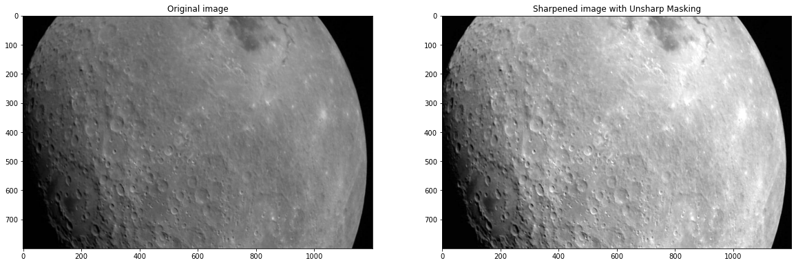

# various-image-processing

# Overview
This project was done with the goal of exploring various image preprocessing techniques that could then be applied to more complex image analysis projects. It involves processing of different kind of images and covers transformations, corrections, object detection and object isolation. 

# Analysis 1 - Image Transformation
This analysis involved the transformation of images under the following transformation function. The results of the transformation can be changed by using another transformation function. The transformed images are compared side-by-side with their original ones.

  

  

  

# Analysis 2 - Image Enhancement
This analysis had the goal to enhance an image. One method of image enhancement could be color balance adjustment. This technique adjusts the color balance and can thus help to improve the overall color tone of the image. It can be used to bring out more natural-looking colors in the image. Another technique that could be applied is Histogram equalization. This is a technique for adjusting the contrast of an image by modifying the image's histogram. It can help to bring out more details in both the bright and dark areas of the image.

## 1. Color Balance Adjustment

  

## 2. Histogram equalization

  

# Analysis 3 - Brightness Improvement
The goal of this analysis was to improve the image in terms of perceived brightness. One technique that can achieve that is Gamma correction. This technique involves applying a nonlinear adjustment to the pixel values in an image to change its brightness and contrast.

  

# Analysis 4 - Image Sharpening
The goal of this analysis was the sharpening of images. Two techniques were applied and compared. The first one was the Unsharp Masking technique. The second was the Negative Sharpening technique. Negative sharpening produced much better results than the Unsharp Masking. 

## 1. Unsharp Masking

  

## 2. Negative Sharpening

  

# Analysis 5 - Recreation of transformed image
In this analysis two versions of the same image were used, the original and a transformed one with unknown transformations applied to it. The analysis involved the assessment of the uknown transformations and the transformation of one image to the other and vice-versa. 

## 1. From original to transformed image
The transformed image was used as reference for the transformation. The transformations in order of appliance were the following: gamma correction, negative sharpening with Gaussian kernel, high-pass filter through convolution with a kernel

  

  

## 2. From transformed image to original
The original image was used as reference for this transformation. The transformations in order of appliance were the following: gamma correction and inversion, low-pass filtering, histogram equalization, Gaussian blurring, unsharp masking, contrast stretching.

  

  

# Analysis 6 - Object detection
The goal of this analysis was to detect the windows of the house in the image. The edges and corners of the image were detected and based on them a rough estimation of the windows of the house was achieved.

  

# Analysis 7 - Object Isolation
The goal of this analysis was to isolate the cue from the billiard table. Since the billiard cue was the sole straight line of the image, it was detected using HughLinesP function. The image was then transformed in black and white. Since a ball was connected to the cue the HoughCirclesC function was used to detect the circles in the image (balls) and a black mask was applied to each one, effectively removing them from the image. The same black mask was applied to the rest of the non-linear objects (whole image besides the cue), thus effectively isolating the object.

  

# Future Work
The above analysis was built as a blueprint that could be transformed into a pipeline, so that it could be used in future image analysis projects that involved similar preprocessing. During the project it became apparent that some of the analyses couldn't be completely automated and pipelinized, because the transformations applied were highly image and goal dependent (like the lungs analysis - different images may require completely different transformations). The only analyses that could be completely automated seem to be the first two, where simple processing transformations are applied. The rest of the code will probably remain as it is and with some tweaks it could be applied to another project requiring similar operations. 